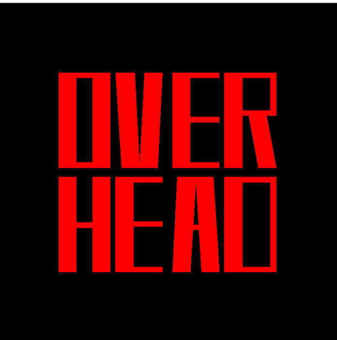

  
  

      Overhead is a rudimentary game engine, made using Java SE8, LWJGL (Light Weight Java Gaming Library) and JOML (Java OpenGL Math Library). 
      It is equipped with:
      <ol>
        <li>
          an entity system
        </li>
        <li>
          an animation system
        </li>
        <li>
          a collision system
        </li>
        <li>
          a tileset system
        </li>
        <li>
          a texture system
        </li>
        <li>
          a world
        </li>
        <li>
          an input handler
        </li>
        <li>
          a camera
        </li>
        <li>
          shaders
        </li>
        <li>
          a screen tile renderer
        </li>
     </ol>  
  

  <a href='https://www.youtube.com/watch?v=oxdO2_ccgTQ'>Trailer</a>
  
  
  
  <h1> Gallery </h1>
  <h3> This is a gallery for Overhead: The Game (a small game made in Overhead: The Engine) </h3>
  
  <h6>
      Overhead: The game is a short maze. The player has to navigate through it. The sole purpose of this game is to test the functionalities of the Engine.
  </h6>
  
   
  

      1. An independent window is initialised. For those familiar with Windows forms, this is a classic SDI Win-form.
  

  
  
  

      2.The player is an entity. It has its anims set by the animation system, which has the options to add new anims (this example only has an idle and running animation). It           also has a collidable.
       
      3. Input is handled by the Input.java class. It too can be customised for additional input events.
       
      4. An entity for the floor is also present. It does not have a collidable attached, so the player can walk on it.
  

  
  
  

      5.There is an entity for the walls, with its collidable. The player and the walls are in the same collision layer, and hence they collide.
       
      6. The collidable work through the concept of Axis Aligned Bounding Boxes (AABB).
  

  
  
  

      7. A camera is also initialised. It is made to follow the player, with smoothness. There is also a 'blind region', wherein if player moves, the camera will not budge.
       
      8. There are also bounds to the world, inside which the camera is wrapped. That is, if the player reaches the edges of the world, the camera stops moving.
  

  
  
  

      8. The viewport (area visible inside the camera) is the only place where the textures are rendered. Everywhere outside the camera is not rendered. This is an attempt at            hyper-efficiency for the largest of in-game worlds.
  

  
  
  

      9. The renderer, animations, and basically everything that needs work frame-by-frame works at the same refresh-rate. This is set up using pretty standard timer and                  interval logic. Here, it is capped at 60 fps (customisable).
  

  
  
  
  
  <h1> Prerequisites </h1>
  <ul>
      <li>
        <a href='https://www.oracle.com/in/java/technologies/javase/javase-jdk8-downloads.html'> Java SE8 SDK </a>
      </li>
      <li>
        <a href='https://www.eclipse.org/downloads/packages/release/kepler/sr1/eclipse-ide-java-developers'> Eclipse IDE for Java </a>
      </li>
      <li>
        <a href='https://www.lwjgl.org/download'> LWJGL </a>
      </li>
      <li>
        <a href='https://jar-download.com/?search_box=joml'> JOML </a>
      </li>
  </ul>
  
  
  
  <h1> Getting Started </h1>
  

      1. Start up eclipse. In the toolbar, go to 'File' -> 'Open Projects from File System'.
  

  

  

      2. Navigate to the folder *which is the parent* of the folder which has all project files*. Select that folder.
  

  
    
  

      3. Select the option 'Search for nested projects' (beware, this option loads all project in the selected folder). Press 'Finish'.
  

  
    
  

      4. In the Package Explorer, navigate through Overhead -> src -> game -> Overhead.java
  

  
    
  

      5. Press the 'Run' button as shown in the image
  

  
    
  

      Enjoy! <a href='https://www.eclipse.org/getting_started/'>Operating through Eclipse</a> is a breeze.
  

  
  
  
  <h1> Deployment </h1>
  

      There is no implementation for a sophisticated deployment system. 
        
      One can pack and encrypt all files in order except the Overhead.java file, to make it a faux-deployed application.
  

   
   
   
  <h1> Built with </h1>
  <ul>
      <li>
        <a href='https://www.eclipse.org/downloads/packages/release/kepler/sr1/eclipse-ide-java-developers'> Eclipse IDE for Java </a>
      </li>
      <li>
        <a href='https://www.lwjgl.org/download'> LWJGL </a>
      </li>
      <li>
        <a href='https://jar-download.com/?search_box=joml'> JOML </a>
      </li>
  </ul>
   
   
   
  <h1> Co-authors </h1>
  

      <a href='https://github.com/smitp1402'> Smit Panchal </a>
       
      <a href='https://github.com/edgeemperor'> Sanpreet Singh Gill </a>
  

   
   
   
  <h1> Acknowledgments </h1>
  

      Taught completely by the YouTube course <a href='https://www.youtube.com/watch?v=VH9KAhjXVFM&list=PLILiqflMilIxta2xKk2EftiRHD4nQGW0u'>game development in LWJGL by Warmful       Development</a>.
  

